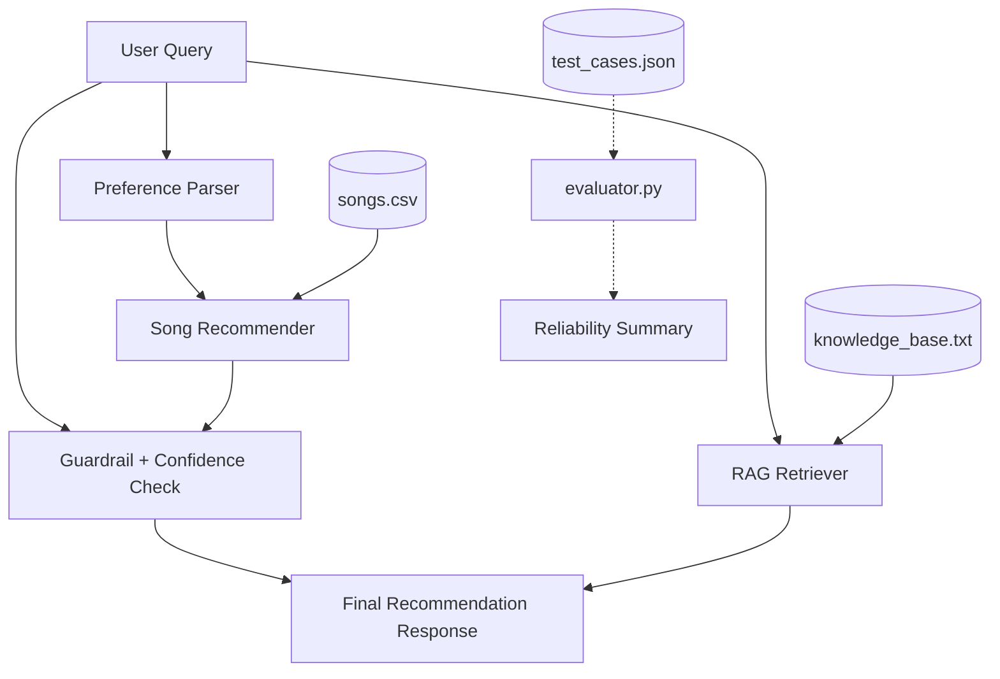

# Music Discovery AI Assistant (Project 4)

## Summary
The Music Discovery AI Assistant is an interactive system that takes natural language queries and recommends songs based on a user's implied preferences. It combines a deterministic scoring algorithm with a Retrieval-Augmented Generation (RAG) system, safety guardrails, and confidence scoring to provide reliable, explainable recommendations.

## Original Project Section
This project extends my Module 3 Music Recommender Simulation. The original version loaded songs from a CSV file, compared them against a user taste profile, and ranked songs using a weighted scoring algorithm based on genre, mood, energy, and tempo.

## What was added for Project 4
To turn the recommender into an Applied AI System, the following features were added:
1. **Natural Language Parsing**: A system to extract preferences (genre, mood, energy) from user queries.
2. **RAG Knowledge Base**: A simple retrieval system that finds relevant context about music recommendation logic.
3. **Guardrails**: Safety checks to block unsupported requests (like movies or medical advice) and warn users when recommendation confidence is low.
4. **Confidence Scoring**: A normalized metric showing how well the retrieved songs match the query.
5. **Logging**: Built-in Python logging to track user inputs, retrieved context, and system decisions.
6. **Evaluation Harness**: An automated script (`evaluator.py`) to run standardized test cases and output a reliability summary.

## Architecture Overview
The system architecture follows a linear pipeline with safety checks. A user query is first passed through a domain guardrail. If approved, preferences are parsed, and the RAG module fetches context. The recommender then scores songs. Finally, a quality guardrail assesses the confidence score before generating the final response.

## Architecture Diagram


## Setup Instructions
1. Clone the repository.
2. Ensure you have Python 3.8+ installed.
3. No external paid APIs are required (runs 100% locally using standard libraries).

## How to run the app
To run the interactive assistant simulation:
```bash
python -m src.main
```

## How to run evaluator.py
To run the test harness and see the reliability summary:
```bash
python evaluator.py
```

## Sample Interactions

**Input 1**: `"Recommend chill songs for studying"`
**Output**: 
```
Assistant: Music Assistant Response for: 'Recommend chill songs for studying'
Confidence: 0.81

Knowledge Base Context:
- Mood matching: Mood is critical for contextual recommendations (e.g., studying, gym, relaxing). Matching the exact mood provides a +1.0 score boost.
- Tempo matching: Tempo (BPM) strongly correlates with energy. Fast tempos (120+ BPM) are better for high-energy activities like the gym, while slow tempos (<90 BPM) are better for chill or sad moods.

Here are your top song recommendations:
1. Midnight Coding by LoRoom (Score: 2.58)
   Reason: mood match (+1.0), energy similarity (+1.00)
2. Morning Coffee by Lofi Girl (Score: 2.55)
   Reason: mood match (+1.0), energy similarity (+0.95)
```

**Input 2**: `"Can you recommend some good movies?"`
**Output**: 
```
Assistant: Unsupported request: The system is designed for music recommendations only. Keyword 'movie' detected.
```

## Design Decisions and Trade-offs
- **Keyword Overlap for RAG**: Instead of using a vector database (like Chroma or FAISS) and embedding models, I used a lightweight token overlap method. This avoids heavy dependencies but sacrifices semantic understanding (e.g., it doesn't know "film" and "cinema" are related unless explicitly listed).
- **Rule-Based Parsing**: Preference extraction is currently rule-based rather than LLM-driven. This keeps the system fast and 100% local, but it can be rigid with unusual phrasing.

## Testing Summary
An automated test harness (`evaluator.py`) runs 6 distinct queries against the system, testing for happy paths (e.g., gym songs), out-of-domain requests, and conflicting parameters. The system successfully blocks unsupported requests and returns appropriate confidence scores for weird inputs. 

## Reflection
Building this Applied AI System taught me how to wrap a core algorithm in an "agentic" shell. Adding guardrails and RAG context completely changed how the application feels—it's no longer just a math script, but a responsive assistant. The most challenging part was deciding how to calculate a meaningful "confidence score" without true probabilities, which I solved by normalizing the recommender's weighted scores.

## Loom Video
[[Loom Link Video Walkthrough](https://www.loom.com/share/e1c5d9abebf84125afdc14c8589915b3)]
