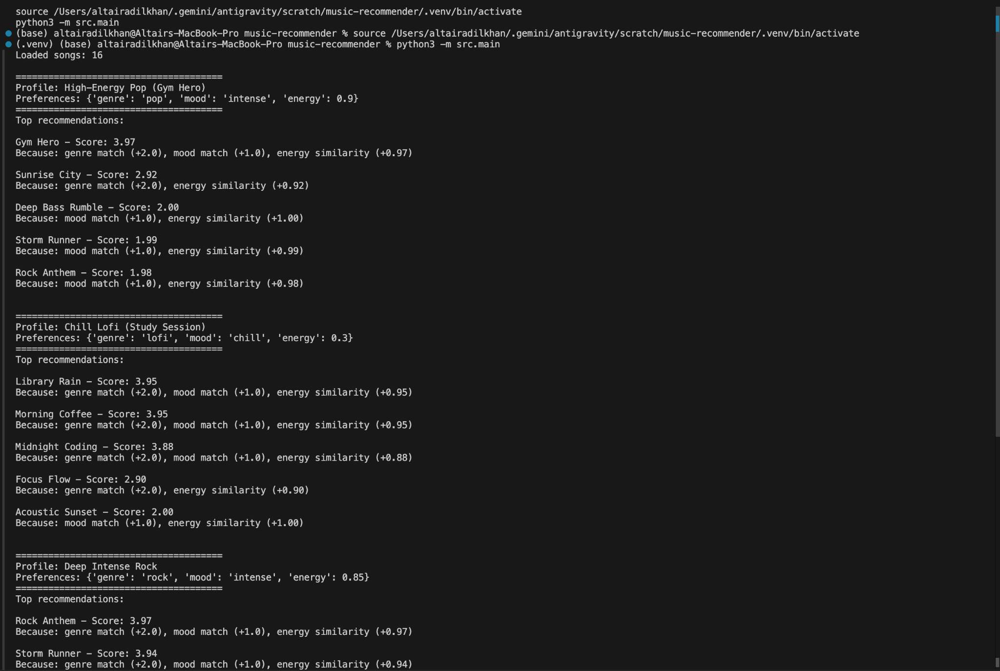
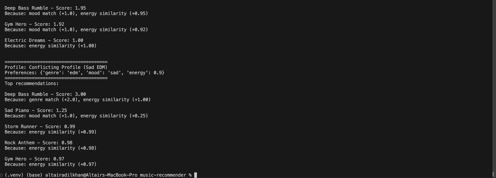
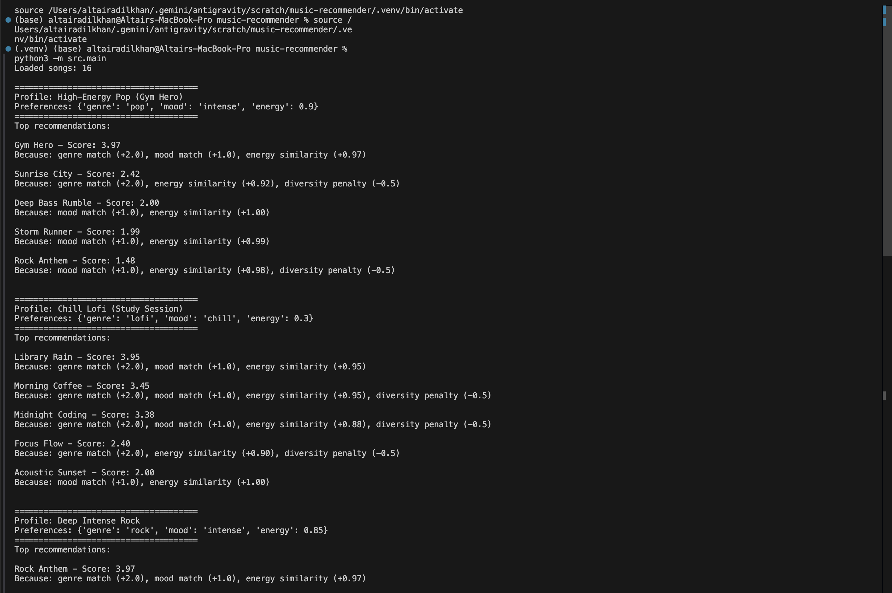
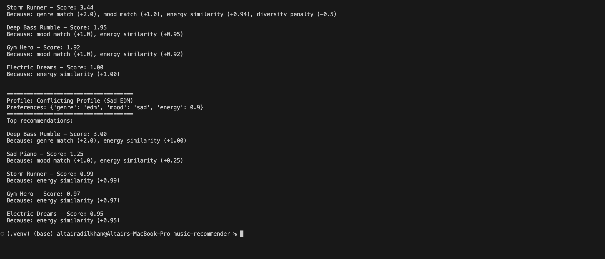

# 🎵 Music Recommender Simulation

## Project Summary

In this project you will build and explain a small music recommender system.

Your goal is to:

- Represent songs and a user "taste profile" as data
- Design a scoring rule that turns that data into recommendations
- Evaluate what your system gets right and wrong
- Reflect on how this mirrors real world AI recommenders

This version implements a content-based recommendation system that scores songs based on genre match, mood match, and numerical energy similarity. It simulates the "filter bubbles" that surface when algorithms depend entirely on simple heuristics without addressing user diversity or deeper item qualities.

---

## How The System Works

The system operates strictly on a **content-based filtering** algorithm. Rather than looking at what users with similar tastes listened to (collaborative filtering), it evaluates songs purely on their inherent attributes compared to a specified target profile.

- **Features Used:** `genre`, `mood`, and `energy`.
- **UserProfile:** A dictionary containing the user's `genre` preference, `mood` preference, and a `target_energy` (a float from 0.0 to 1.0).
- **Scoring Recipe:** 
  - +2.0 points for a genre match
  - +1.0 point for a mood match
  - Up to +1.0 point for energy similarity (calculated as `1.0 - absolute_difference(song_energy, target_energy)`)
- **Ranking:** All songs are scored, and the system sorts the catalog in descending order based on total score. The top `k` results are returned as predictions.

---

## Getting Started

### Setup

1. Create a virtual environment (optional but recommended):

   ```bash
   python -m venv .venv
   source .venv/bin/activate      # Mac or Linux
   .venv\Scripts\activate         # Windows
   ```

2. Install dependencies

```bash
pip install -r requirements.txt
```

3. Run the app:

```bash
python -m src.main
```

### Running Tests

Run the starter tests with:

```bash
PYTHONPATH=. pytest
```

You can add more tests in `tests/test_recommender.py`.

---

## Experiments You Tried

I tested four diverse user profiles to see how the system reacted:
1. **High-Energy Pop (Gym Hero)**: Successfully favored pop songs with high energy like 'Gym Hero' and 'Sunrise City'.
2. **Chill Lofi (Study Session)**: Brought up chill, lofi tracks with appropriately low energy, demonstrating how well genre and mood aligned with target energy.
3. **Deep Intense Rock**: Captured rock anthems immediately but also surfaced an intense EDM track due to matching maxed-out energy and the "intense" mood requirement.
4. **Conflicting Profile (Sad EDM)**: The system hit a filter bubble. A genre match for "edm" and an extreme energy of 0.9 clashed with a mood of "sad". The top result was 'Deep Bass Rumble' (purely on genre + energy), while 'Sad Piano' placed second (mood match) despite its very low energy pulling its score down heavily. 

**Terminal Output Snapshot:**
before optional part was done:



**After optional part was done:** 



---

## Limitations and Risks

- **Over-prioritization of Genre**: With genre rated at +2.0, an amazing track spanning other parameters might be completely buried simply because of a genre mismatch.
- **Tiny Catalog limitation**: I am prone to surfacing the exact same tracks whenever user requirements mirror a specific label closely.
- **Limited Nuance**: I don't examine subgenres or contextual flags (e.g., decade of release), treating all "rock" as identically matched.

---

## Reflection

Read and complete `model_card.md`:

[**Model Card**](model_card.md)

Building this system illustrated exactly how quickly an AI goes from a "blank slate" to a highly opinionated agent that forces users down narrow funnels. A mathematical approach to music inherently prioritizes quantifiable features (tempo, energy metadata) over harder-to-define "vibe" markers, leading to an extremely literal translation of human taste.

A key revelation was how algorithm bias acts as an echo chamber. When evaluating my 'Sad EDM' profile, instead of finding a nuanced middle-ground (an atmospheric high-energy trap track), the system aggressively fragmented. It returned either a happy hyper-energetic EDM track or a clinically sad classical piece. In reality, taste is deeply intersecting, not purely additive, meaning real-world algorithms need complex non-linear models to truly 'understand' what the user feels.
